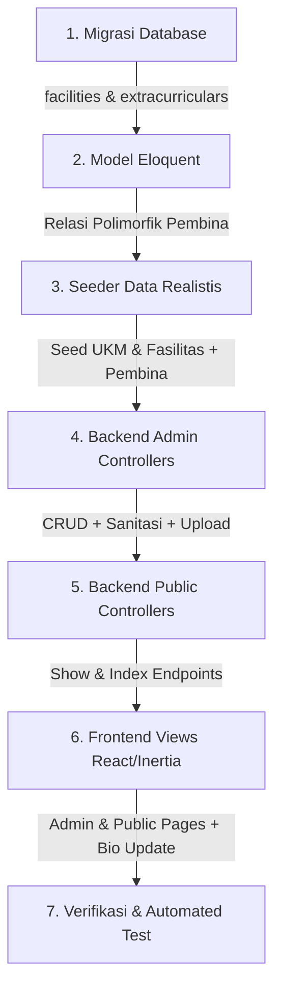

# Master Plan: Implementasi Mandiri Fasilitas & Ekstrakurikuler (UKM) Terintegrasi Pembina Dosen/Tendik

Dokumen ini menguraikan arsitektur dan tahapan implementasi fitur **Fasilitas Kampus** dan **Ekstrakurikuler / Unit Kegiatan Mahasiswa (UKM)** secara mandiri dan terpisah, lengkap dengan integrasi Master Data Jabatan untuk **Pembina UKM** serta sinkronisasi otomatis ke profil/bio Dosen dan Tenaga Kependidikan.

---

## 1. Prinsip Utama & Pemisahan Arsitektur

1. **Modul Internal CMS (Bukan di Luar Sistem), Namun Mandiri & Terpisah Antar-Keduanya**:
   * **Tetap di dalam sistem ini**: Modul Fasilitas dan Ekstrakurikuler 100% merupakan bagian bawaan dari sistem CMS Laravel ini (satu database, satu panel dashboard admin, satu autentikasi peran/hak akses). Sama sekali **BUKAN sistem luar / eksternal**.
   * **Mandiri & Terpisah Antar-Keduanya**: Modul **Fasilitas** dan modul **Ekstrakurikuler (UKM)** dipisah tabel database dan menu adminnya (tidak dicampur jadi satu modul/tabel campur aduk), karena domain datanya berbeda total:
     - **Fasilitas** (`facilities`): Sarana fisik, laboratorium, gedung, jam operasional, kapasitas, PIC kontak, dan panduan peminjaman.
     - **Ekstrakurikuler** (`extracurriculars`): Organisasi kemahasiswaan/UKM, visi, misi, prestasi, open recruitment, media sosial resmi (termasuk TikTok), dan Pembina Dosen/Tendik.

2. **Dinamis & Fleksibel**:
   * Fitur/spesifikasi fasilitas dan prestasi UKM bersifat dinamis (JSON array).
   * Kategori dapat dikelompokkan secara baku.

3. **Integrasi Jabatan Pembina dengan Master Data [StructuralPosition.php](file:///d:/Titip/cmsapparel/app/Models/StructuralPosition.php)**:
   * **Selaras Penuh dengan Master Data Jabatan**: Jabatan pembina ekstrakurikuler TIDAK di-hardcode, melainkan bersumber langsung dari model master [StructuralPosition.php](file:///d:/Titip/cmsapparel/app/Models/StructuralPosition.php) (dengan filter `target_scope` = `extracurricular` atau `all`).
   * Pilihan jabatan yang tersedia dikelola secara dinamis di menu Master Jabatan Struktural (contoh: *Pembina UKM*, *Pembina Utama*, *Pembina Teknis / Pendamping*, *Koordinator Kemahasiswaan*).
   * Pada saat mengelola Ekstrakurikuler, Admin memilih jabatan dari master [StructuralPosition.php](file:///d:/Titip/cmsapparel/app/Models/StructuralPosition.php), lalu memilih personel Dosen/Tendik dari [StaffProfile.php](file:///d:/Titip/cmsapparel/app/Models/StaffProfile.php).
   * Relasi disimpan ke dalam tabel polimorfik `structural_assignments` (`assignable_type` = `App\Models\Extracurricular`).

4. **Sinkronisasi Otomatis di Single Bio/Profil Dosen & Tendik**:
   * Jabatan Pembina otomatis terangkai di atribut `auto_structural_position` dosen/tendik (misal: *"Pembina UKM Robotika & Kecerdasan Buatan"*).
   * Pada halaman detail publik Dosen/Tendik (`/dosen-dan-tendik/{slug}`), tampil seksi khusus **"Pembina Ekstrakurikuler & Kemahasiswaan"** lengkap dengan badge dan tautan langsung ke halaman profil UKM tersebut.

5. **Kepatuhan Standar Enterprise**:
   * URL publik dalam Bahasa Indonesia baku tanpa ID numerik: `/fasilitas`, `/fasilitas/{slug}`, `/ekstrakurikuler`, `/ekstrakurikuler/{slug}`.
   * Proteksi total XSS (`HtmlSanitizer`), bebas SQL Injection, bebas IDOR, bebas webshell (lewat `ImageUploadService`), dan bebas N+1 query problem.

---

## 2. Rincian Skema Database & Model

### A. Tabel `facilities` (Fasilitas Kampus)
| Kolom | Tipe | Keterangan |
| :--- | :--- | :--- |
| `id` | bigint (PK) | Auto increment |
| `name` | varchar(255) | Nama fasilitas (contoh: *Gelanggang Olahraga & Stadion Utama*) |
| `slug` | varchar(255) (unique) | Slug URL publik bebas ID (`/fasilitas/{slug}`) |
| `category` | varchar(50) | `akademik`, `laboratorium`, `olahraga`, `seni_budaya`, `layanan_umum`, `kesehatan_ibadah` |
| `short_description` | text | Ringkasan fasilitas untuk kartu cuplikan |
| `description` | longText | Konten detail & ulasan fasilitas (HTML tersanitasi) |
| `features` | json | Daftar keunggulan/spesifikasi (misal: AC, Kapasitas 2.000 kursi, Sound system, Wi-Fi 6) |
| `location` | varchar(255) | Lokasi gedung/kampus |
| `operational_hours` | varchar(255) | Jam operasional pelayanan |
| `contact_person` | varchar(255) | Nama PIC/Pengelola fasilitas |
| `contact_phone` | varchar(50) | WhatsApp/telepon reservasi |
| `booking_info` | text | Ketentuan & panduan peminjaman fasilitas |
| `booking_url` | varchar(500) | Tautan formulir reservasi online (jika ada) |
| `primary_image_path` | varchar(500) | Foto utama cover fasilitas |
| `gallery_images` | json | Galeri foto-foto pendukung fasilitas |
| `sort_order` | integer | Urutan prioritas tampil |
| `is_active` | boolean | Status publikasi |
| `timestamps` | timestamp | `created_at`, `updated_at` |

### B. Tabel `extracurriculars` (Ekstrakurikuler / UKM)
| Kolom | Tipe | Keterangan |
| :--- | :--- | :--- |
| `id` | bigint (PK) | Auto increment |
| `name` | varchar(255) | Nama organisasi/UKM (contoh: *UKM Robotika & Kecerdasan Buatan*) |
| `slug` | varchar(255) (unique) | Slug URL publik (`/ekstrakurikuler/{slug}`) |
| `abbreviation` | varchar(50) | Singkatan resmi (misal: *ROBOTIK*, *MAPALA*, *PSM*) |
| `category` | varchar(50) | `penalaran_keilmuan`, `seni_budaya`, `olahraga`, `keagamaan`, `sosial_kemanusiaan` |
| `description` | longText | Deskripsi profil UKM (HTML tersanitasi) |
| `vision` | text | Visi UKM |
| `mission` | text | Misi UKM |
| `achievements` | json | Daftar prestasi unggulan (misal: Juara 1 Nasional 2025) |
| `activities_overview` | text | Jadwal latihan rutin & agenda tahunan |
| `registration_info` | text | Ketentuan pendaftaran anggota baru (Open Recruitment) |
| `registration_url` | varchar(500) | Tautan formulir pendaftaran anggota baru |
| `facebook_url` | varchar(500) | Tautan Facebook resmi |
| `instagram_url` | varchar(500) | Tautan Instagram resmi |
| `x_url` | varchar(500) | Tautan X/Twitter resmi |
| `tiktok_url` | varchar(500) | **Tautan TikTok resmi** |
| `youtube_url` | varchar(500) | Tautan YouTube resmi |
| `website_url` | varchar(500) | Website resmi UKM |
| `email` | varchar(255) | Email korespondensi UKM |
| `phone` | varchar(50) | Kontak pengurus/ketua UKM |
| `office_location` | varchar(255) | Ruang sekretariat (misal: Gedung PKM Lantai 2 Ruang 203) |
| `logo_path` | varchar(500) | Logo resmi UKM |
| `cover_image_path` | varchar(500) | Banner cover UKM |
| `gallery_images` | json | Galeri foto kegiatan UKM |
| `sort_order` | integer | Urutan tampil |
| `is_active` | boolean | Status aktif |
| `timestamps` | timestamp | `created_at`, `updated_at` |

---

## 3. Integrasi Pembina Struktural & Sinkronisasi Dosen/Tendik

1. **Pembaruan Scope Master Jabatan**:
   * Tambahkan scope `extracurricular` pada Master Jabatan Struktural (contoh: *Pembina UKM*, *Pembina Utama*, *Pembina Pendamping Teknis*).
2. **Penetapan Polimorfik**:
   * Tabel `structural_assignments`:
     * `assignable_type` = `App\Models\Extracurricular`
     * `assignable_id` = ID Ekstrakurikuler
     * `structural_position_id` = ID Jabatan dari Master Jabatan
     * `staff_profile_id` = ID Dosen/Tendik
     * `decree_number` = Nomor SK Rektor Pembina UKM
3. **Refleksi Otomatis di Single Profil Dosen/Tendik**:
   * Dosen yang membina UKM otomatis mendapatkan relasi `activeAssignments` yang memuat objek `Extracurricular`.
   * Pada halaman detail publik civitas (`resources/js/Pages/Public/Lecturers/Show.jsx`), ditampilkan blok visual:
     ```
     🛡️ Amanah Pembina Ekstrakurikuler
     • Pembina Utama UKM Robotika & Kecerdasan Buatan (SK Rektor No. 12/SK/2025)
     ```
     Lengkap dengan tautan yang dapat diklik ke halaman profil UKM tersebut.

---

## 4. Rute Publik & Rute Administrasi

### A. Rute Publik (Bahasa Indonesia Baku Bebas ID)
```php
// Fasilitas Kampus
Route::get('/fasilitas', [FacilityPublicController::class, 'index'])->name('public.facilities.index');
Route::get('/fasilitas/{facility:slug}', [FacilityPublicController::class, 'show'])->name('public.facilities.show');

// Ekstrakurikuler & UKM
Route::get('/ekstrakurikuler', [ExtracurricularPublicController::class, 'index'])->name('public.extracurriculars.index');
Route::get('/ekstrakurikuler/{extracurricular:slug}', [ExtracurricularPublicController::class, 'show'])->name('public.extracurriculars.show');
```

### B. Rute Admin (Dalam Grup Middleware Auth & Permission)
```php
// Fasilitas
Route::resource('fasilitas', FacilityController::class)->names('admin.facilities');

// Ekstrakurikuler
Route::resource('ekstrakurikuler', ExtracurricularController::class)->names('admin.extracurriculars');
```

---

## 5. Rencana Tahapan Eksekusi



1. **Langkah 1: Database Migration**
   * Buat migrasi `create_facilities_and_extracurriculars_tables`.
   * Jalankan `php artisan migrate`.
2. **Langkah 2: Model & Relasi**
   * Buat `app/Models/Facility.php`.
   * Buat `app/Models/Extracurricular.php` dengan relasi `structuralAssignments()` dan `currentAssignments()`.
   * Perbarui `app/Models/StaffProfile.php` untuk memuat pembinaan UKM.
3. **Langkah 3: Seeder Komprehensif**
   * Buat seeder dengan data fasilitas unggulan (Perpustakaan Digital, Lab AI & Robotika, Sport Center, Asrama) dan UKM unggulan (Robotika, Paduan Suara, Mapala, KSR PMI).
   * Hubungkan Dosen dan Tendik sebagai Pembina resmi.
4. **Langkah 4: Admin Controllers & Rute**
   * Buat `App\Http\Controllers\Admin\FacilityController.php`.
   * Buat `App\Http\Controllers\Admin\ExtracurricularController.php`.
   * Daftarkan rute admin & publik di `routes/web.php`.
5. **Langkah 5: Frontend Views (Inertia React)**
   * Admin Views:
     * `Facilities/Index.jsx` & `Facilities/Form.jsx` (Input fitur/spesifikasi dinamis, galeri, jam operasional).
     * `Extracurriculars/Index.jsx` & `Extracurriculars/Form.jsx` (Input prestasi dinamis, pemilihan Pembina dari master jabatan & dosen, medsos TikTok).
   * Public Views:
     * `Public/Facilities/Index.jsx` & `Public/Facilities/Show.jsx`.
     * `Public/Extracurriculars/Index.jsx` & `Public/Extracurriculars/Show.jsx` (Kartu Pembina, Prestasi, Jadwal Latihan, Medsos).
   * Pembaruan `Public/Lecturers/Show.jsx` (Tampilkan jabatan Pembina UKM).
6. **Langkah 6: Navigasi & Test Suite**
   * Tambahkan menu di `AppSidebar.jsx` dan `PublicLayout.jsx`.
   * Tambahkan test case di `tests/Feature/FacilityAndExtracurricularTest.php`.
   * Jalankan `npm run build` dan `php vendor/bin/phpunit`.
